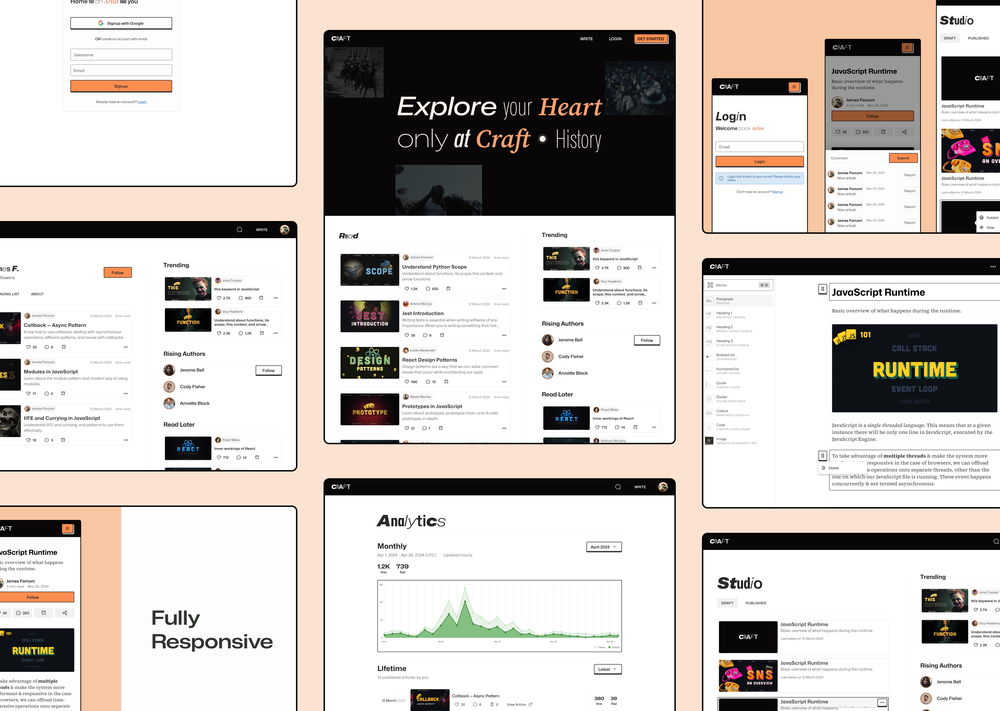

# Craft

A place where professionals share their thoughts and ideas regarding the craft they're passionate about.



[Demo](https://www.youtube.com/watch?v=x2bsTxkVPXk)

## Features

- OAuth w/ Google, magic email login, access/refresh token auth flow
- Analytics (read time, views, engagement - likes, comments)
- Reading list (just like YouTube's playlist - save articles)
- Text search
- Extensible editor (supports - paragraph/headings, image, quote, divider)
- Dynamic saving (check what's new/updated/deleted and take action)
- Studio for managing "my" articles
- Fully responsive
- Different rendering patterns (ISR, SSR, SSG, CSR) based on page content
- Design system ([Figma](https://www.figma.com/design/jufexyNYxQYFX1zwtFIiRg/craft?node-id=319-572&t=Q0fHWa6OcqtnvmZ0-1))

## Getting Started

Environment variables:

Create `backend/.env` file and then add content of `backend/.env.example` in it along with missing env variables. Do the same with `frontend/.env` and `frontend/.env.example`.

```bash
cp ./backend/.env.example ./backend/.env
cp ./frontend/.env.example ./frontend/.env
```

Starting backend:

Before starting backend make sure to have MongoDB setup and update `DATABASE_URL` in `backend/.env`.

```bash
cd backend/
pnpm install
pnpm run dev:start
```

Starting frontend:

```bash
cd frontend/
pnpm install
pnpm run dev
```

## Technologies

Frontend:

- TypeScript, React, Next.js (page router)
- ChakraUI, React Beautiful DnD, Recharts
- React Query, Redux Toolkit, React Hook Form, Zod

Backend:

- TypeScript, Nest.js
- Passport.js, Express File Upload
- Cloudinary
- MongoDB, Mongoose

## Next Steps

- Add tests in frontend (Jest, RTL, Playwright) and backend (Jest)
- Add husky
- Dockerize the whole project
- Make editor block rich and add other blocks (code/horizontal-group/list/callout)
- Add notifications system
- Add caching for analytics endpoints

## License

[MIT License](./LICENSE)
